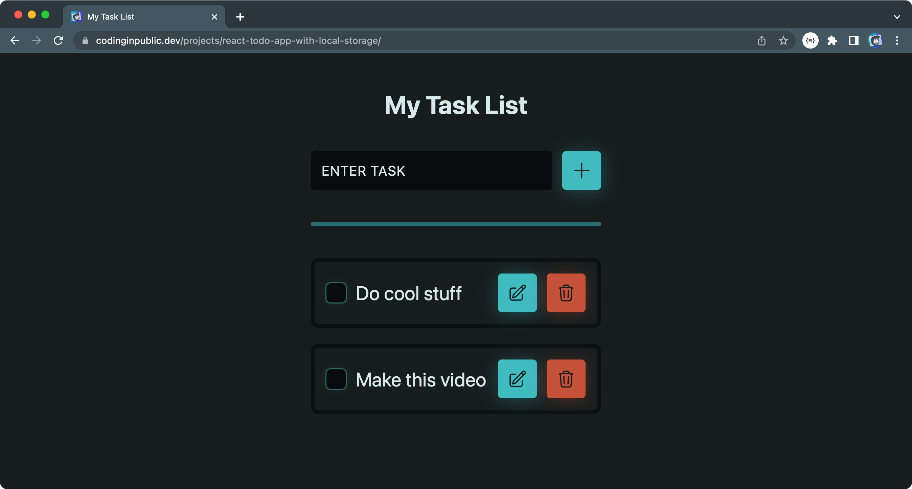
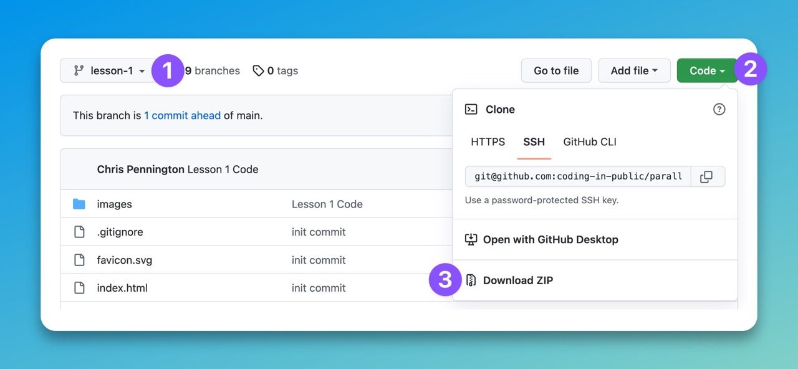

# React Todo App with Local Stroage

During the course of this series, we’ll use React to build out a todo app that saves and loads to local storage.

[📹 Link to YouTube video 📹](https://youtu.be/LzFY8efOvH8)

## Lesson Help
If you get stuck on any lesson in the series, navigate to the course branch for your current lesson and view or download the code for more help.

To get a project up and running:
1. Unzip the project you downloaded.
2. Open the unzipped directory in you code editor.
3. Run `pnpm install` to install all the dependencies.
4. Run `pnpm run dev` to start the app.

## Assumptions
In this series, I’ll assume you have a working knowledge of HTML and vanilla JavaScript. It would also help to have a basic understanding of React.

## Connect With Me
- My YouTube Channel: https://www.youtube.com/c/CodinginPublic
- Website: https://codinginpublic.dev
- Blog: https://chrispennington.blog
- Twitter: https://twitter.com/cpenned
- Patreon: https://www.patreon.com/coding_in_public

